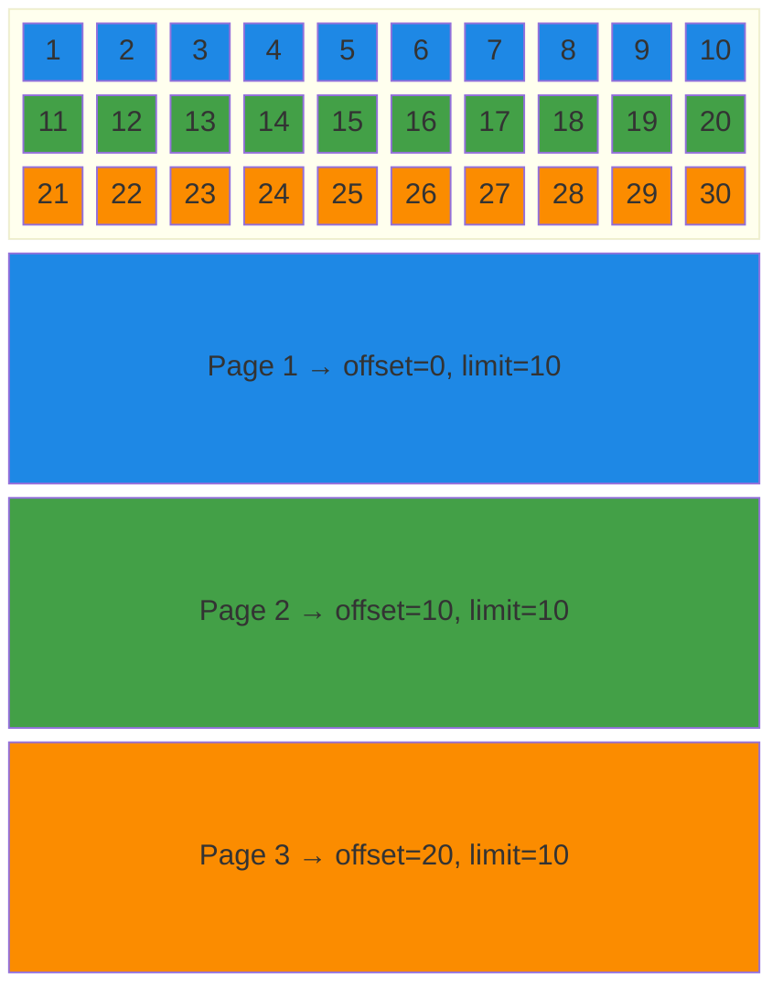
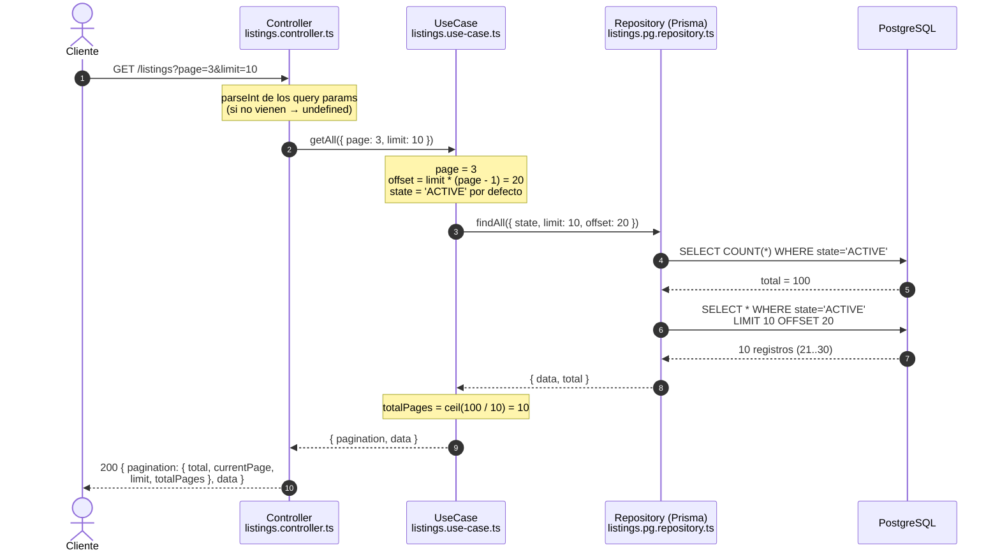
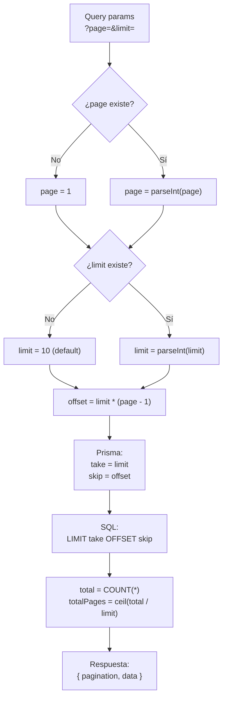

# Api Rest con expressjs

Página: https://expressjs.com/

- `npm init -y`
- `npm install express`
- `npm install --save-dev typescript @types/express @types/node`
https://www.npmjs.com/package/nodemon

tsc --init
```json
{
  "compilerOptions": {
    "target": "esnext",
    "module": "nodenext",
    "rewriteRelativeImportExtensions": true,
    "erasableSyntaxOnly": true,
    "verbatimModuleSyntax": true,
    "noEmit": true,
    "strict": true,
    "skipLibCheck": true
  }
}
```

## Ejemplo básico de api rest
```ts
import express, { type Express, type Request, type Response } from 'express';

const app: Express = express();

app.get('/', (req: Request, res: Response) => {
  res.send('Hello World!');
});

app.listen(3000);
```

Http Methods
- POST -> Crear
- PUT -> Modificación total (upsert, si no existe se crea) 
- PATCH -> Modificación parcial
- DELETE -> Eliminar
- GET -> Consultar


## PRISMA ORM 

https://www.prisma.io/docs/v7/prisma-orm/quickstart/prisma-postgres

`npm install prisma@7.10.0 @types/pg --save-dev`
`npm install @prisma/client@7.10.0 @prisma/adapter-pg pg dotenv`

`npx prisma init`

> Sincronizar la base de datos con el código (schema.prisma)
`npx prisma db pull  `

# PAGINACION

- limit: Nos obtiene x cantidad de datos. Por ejemplo consultar 200 items
- offset: Es el puntero de donde consultamos la información.

Si tenemos un limit de 10 y un total de 100 items. Hay 10 páginas
Con un limit de 10:
Page 1 (limit=10, offset=0). 02 - 12
Page 2 (limit=10, offset=10)
Page 3 (limit=10, offset=20)
Page 4 (limit=10, offset=30)

## ¿Cómo se ve sobre la tabla?

El `offset` (SKIP) salta registros y el `limit` (TAKE) decide cuántos se traen.



La fórmula que traduce la página (lo que pide el cliente) al offset (lo que entiende la base de datos):

```
offset = limit * (page - 1)
totalPages = ceil(total / limit)
```

## Flujo en la aplicación

El cliente piensa en **páginas**, la base de datos piensa en **skip/take**. La traducción ocurre en el caso de uso.



## Cálculo del offset paso a paso



## Equivalencias entre capas

| Concepto | API (query) | Caso de uso | Prisma | SQL |
|---|---|---|---|---|
| Cuántos traer | `limit` | `limit` | `take` | `LIMIT` |
| Desde dónde | `page` | `offset` | `skip` | `OFFSET` |
| Cuántos hay | — | `total` | `count()` | `COUNT(*)` |

> Ojo: `OFFSET` grande es lento, porque la base de datos igual recorre y descarta
> las filas saltadas. Para tablas muy grandes se usa paginación por cursor
> (`WHERE id > ultimoId ORDER BY id LIMIT n`).


# Herramienta de desarrollo 
- nodemon `npm install nodemon -g`

